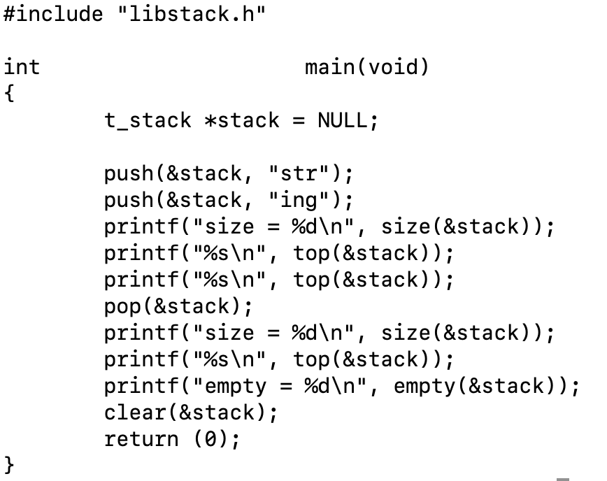
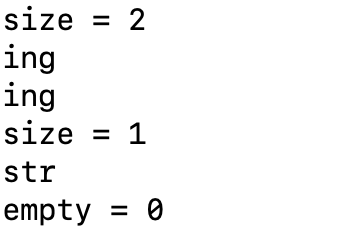

# libstack

C언어에서 스택을 편하게 사용하기 위해 연결리스트로 구현한 라이브러리

## 헤더

  #include "libstack.h"
  
## 스택 선언

  t_stack  * stack = NULL;
  
## 스택 함수

### push()

  void    push(t_stack   * * head, void * content);
  
  스택의 가장 위에 메모리를 생성하여 데이터를 넣는다. 반환값이 없다.

### pop()

  void    pop(t_stack   * * head);
  
  스택의 가장 위에 있는 데이터를 삭제한다. 스택이 비어있는 경우, 아무것도 하지않고 반환한다.

### top()

  void    * top(t_stack   * * head);
  
  스택의 가장 위에 있는 데이터를 반환한다. 스택이 비어있는 경우, NULL을 반환한다.

### new()

  t_stack   * new(void   * content);
  
  t_stack 크기의 새로운 메모리를 생성하여 content 내용을 저장하여 반환한다.

### size()

  int      size(t_stack   * * head);
  
  스택에 있는 데이터의 갯수를 반환한다. 스택이 비어있는 경우, 0을 반환한다.

### empty()

  int     empty(t_stack   * * head);
  
  스택이 비어있는 지 여부를 확인한다. 스택이 비어있는 경우, 1을 반환하고, 스택이 비어있지 않은 경우, 0을 반환한다.

### clear()

  void    clear(t_stack   * * head);
  
  스택에 남아있는 데이터들을 정리하는 함수로 할당된 메모리를 해제하고 종료한다.

## 컴파일 예제

  gcc -L. -lstack main.c

## 스택 예제

