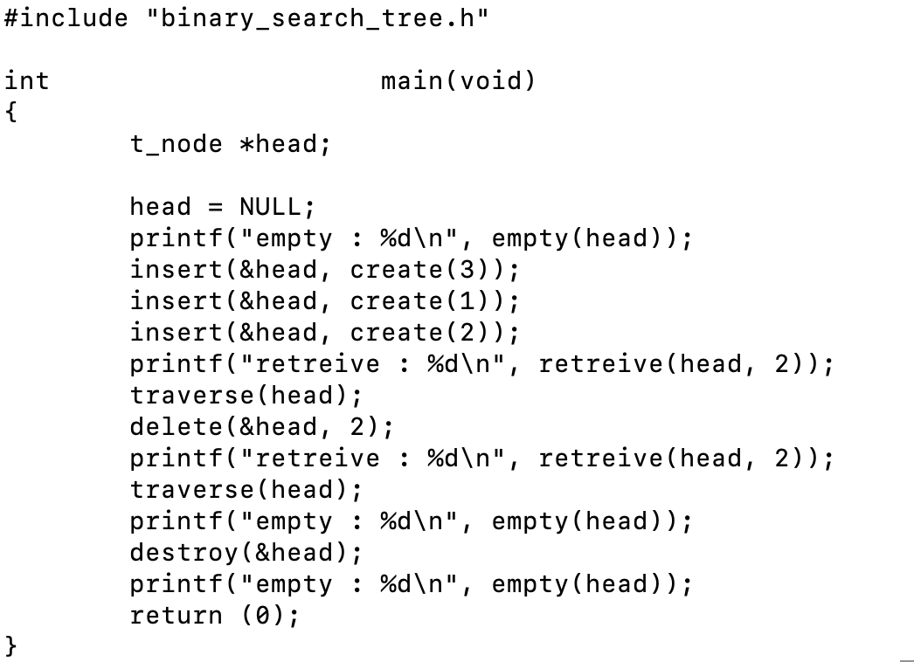
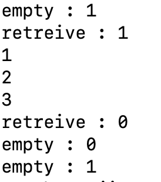

# libtree

C언어에서 이진 탐색 트리를 연결리스트로 구현한 라이브러리

## 헤더

  #include "binary_search_tree.h"
  
## 헤드 선언

  t_node  * head = NULL;
  
## 이진탐색트리 함수

### create()

  t_node   * create(int  content);
  
  새로운 노드를 생성하여 content 값을 저장하고, 해당 노드의 포인터를 반환한다.

### insert()

  void    insert(t_node  * * head, t_node  * new);
  
  새로운 노드 new를 헤드 포인터에 추가하여 저장한다.

### delete()

  void    delete(t_node   * * head, int content);
  
  content 값을 가지는 노드를 찾아 삭제하고, 트리를 정렬한다.

### destroy()

  void    destroy(t_node   * * head);
  
  헤드 포인터에 저장되어 있는 모든 노드를 메모리 해제하고, 헤드 값에 NULL을 저장하여 반환한다.

### empty()

  int     empty(t_node  * head);
  
  헤더가 비어있는 지 확인한다.
  
  헤더 내에 노드가 있는 경우 1을 반환하고, 없은 경우 0을 반환한다.

### retreive()

  int     retreive(t_node  * head, int content);
  
  content 값을 갖는 노드가 있는 지 탐색하고, 노드가 있는 경우 1을 반환하고, 없는 경우 0을 반환한다.

### traverse()

  void    traverse(t_node  * head);
  
  헤드 포인터부터 중위 탐색하여 루트노드부터 모든 노드를 출력한다.

## 컴파일 예제

  gcc -L. -ltree main.c

## 이진탐색트리 예제

### 출력 결과

